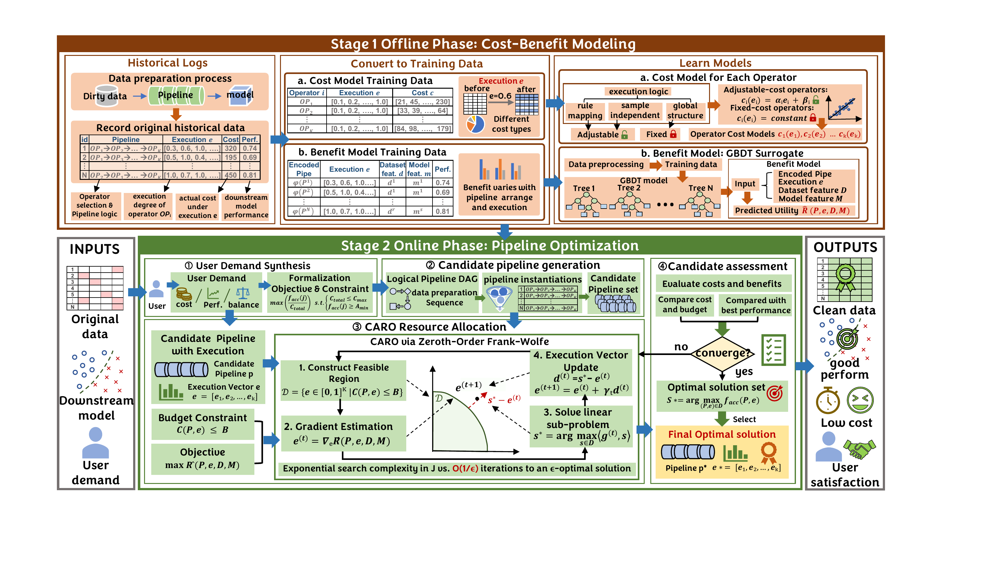

# CBAPrep

A cost-benefit-aware data preparation framework for joint operator selection and
operator-level resource allocation. CBAPrep combines runtime models, a GBDT
benefit predictor, candidate pipeline search and CARO allocation using
zeroth-order Frank-Wolfe (ZOFW).

## Framework overview

[](docs/images/cbaprep-framework.pdf)

CBAPrep combines offline cost-benefit modeling with online pipeline search and CARO resource allocation to meet user-specified cost and performance requirements.

## Release scope

This is a **core implementation release**, not a complete reproduction package
for the paper's tables and figures. It includes the offline model-building entry
points needed by the main workflow and a synthetic API example. It excludes
benchmark datasets, pretrained predictors, hardware-specific cost profiles,
baseline systems, experiment orchestration, plotting scripts and historical
results. No artifact badge or publication acceptance is claimed.

## Installation

Python 3.11 is the tested interpreter. From the repository root:

```bash
python -m venv .venv
# Linux/macOS:
source .venv/bin/activate
# Windows PowerShell instead: .venv\Scripts\Activate.ps1
python -m pip install --upgrade pip
python -m pip install -r requirements.txt
```

CPU PyTorch suffices. For the optional XGBoost classifier, also install
`xgboost`. See `docs/VALIDATION.md` for the environment actually checked.
Run the following commands from the repository root with the environment active.

## Quick start: CARO API

```bash
python -m examples.minimal_caro
```

This exercises the fixed-pipeline optimizer with two synthetic operator degrees,
a utility callback and an affine cost callback. No dataset or pretrained model is
needed. Assertions check degree bounds, budget feasibility, the performance
target and an improvement in synthetic gain/cost over full execution.
Printed accuracy/time fields are **synthetic predictions**, not measured results
or evidence for the paper's experiments.

| Objective | `objective_mode` | Meaning |
|---|---|---|
| CARO-MaxAcc | `budget_performance` | Maximize predicted utility under an execution budget |
| CARO-MinCost | `target_cost` | Minimize predicted cost subject to a performance target |
| CARO-MaxROI | `utility_cost_ratio` | Maximize predicted gain/cost with a denominator stabilizer |

`ratio_baseline_utility` specifies the utility subtracted in the ratio.
The fixed-pipeline adapter also accepts `enforce_budget` and
`enforce_performance_target`. Supply utility in [0,1] and nonnegative cost in
consistent units; projection assumes affine cost in the degrees. ZOFW returns an
approximate candidate, not a globally optimal solution. A predicted budget is not
a measured runtime guarantee.

## Use your own dataset

Create `data/my_dataset/data.csv` with a header and classification target, and
`data/my_dataset/info.json` containing:

```json
{"label": "target"}
```

See `data/README.md`. Use a safe directory name without shell metacharacters;
the automatic launcher treats command-line arguments as trusted local inputs.
Inspect options with:

```bash
python -m modules.optimizer.auto_pipeline_search --help
python -m modules.optimizer.searcher --help
```

Build runtime coefficients, collect benefit-training samples, fit a GBDT and
search pipelines:

```bash
python -m modules.optimizer.auto_pipeline_search --dataset my_dataset --model LR --optimizer zofw --operator_space sota --cost_param e_dataset_method --iterations 300 --max_combos 100 --total_times 1.0
```

This is a usage example, not the paper's protocol. Offline fitting can be
expensive and is **not bounded by `--total_times`**: that option specifies the
predicted preparation execution budget, in seconds. Generated models are stored
under `artifacts/` and reused when available. Keep artifacts for different dataset
contents/configurations separate rather than silently reusing stale predictors.

Once models exist, invoke search directly:

```bash
python -m modules.optimizer.searcher --dataset my_dataset --model LR --optimizer zofw --operator_space sota --cost_param e_dataset_method --search_mode optimize_all --max_combos 100 --total_time 1.0 --objective_mode budget_performance
```

For MinCost use `--objective_mode target_cost --performance_target 0.8`; for
MaxROI use `--objective_mode utility_cost_ratio`. Choose thresholds appropriate
for your data. Use `--eval_split val` during development and reserve test data
for final reporting; do not tune against the final test set. The optional actual
validation output does not replace the paper's evaluation protocol.

Individual offline entry points:

```bash
python -m modules.cost_calculator.extract_dataset_params --help
python -m modules.benefit_predictor.predict_data_generation.run --help
python -m modules.benefit_predictor.gbr_regressor --help
```

Real-data search needs locally fitted cost and benefit models, which are not
bundled. Only load model pickle files from trusted sources.

## Code map

| Path | Purpose |
|---|---|
| `modules/common/` | Dataset lookup and operator vocabulary |
| `modules/methods/` | Data conversion/splitting, cleaning and preprocessing operators |
| `modules/cost_calculator/` | Cost prediction and local runtime profiling |
| `modules/benefit_predictor/` | Benefit sampling, GBDT fitting and inference |
| `modules/optimizer/searcher.py` | Candidate pipeline search and allocation |
| `modules/optimizer/cost_benefit_distribute_fw.py` | Core ZOFW allocator |
| `modules/optimizer/sota_zofw.py` | Fixed-pipeline callback adapter with repeated-stage support |
| `modules/optimizer/auto_pipeline_search.py` | Offline-to-online CLI workflow |
| `modules/ml_modules/Classification/` | Downstream classifier adapters |
| `examples/minimal_caro.py` | Synthetic optimizer example and sanity assertions |

Monte Carlo and compatible FW modules remain because the main searcher imports
and exposes them. Unreferenced runners, study scripts and placeholder frameworks
are excluded. Some code comments remain in Chinese; this usage guide is English.

## Availability and limitations

PVLDB's [submission guidelines](https://www.vldb.org/2027/submission-guidelines.html)
require supplementary materials supporting reported results. This core-only
release does not claim to satisfy complete experimental reproducibility. The
paper's datasets, full experiment commands and pretrained artifacts are outside
this release. See `docs/RELEASE_SCOPE.md` for cleanup and release-only changes.

No software license has been selected. Public availability alone does not grant
a general reuse/redistribution license; contact the maintainers through GitHub
for licensing questions. Report bugs via GitHub Issues. Bibliographic details
can be added when available; no DOI or acceptance status is inferred.
